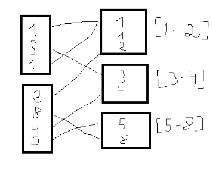

# Practice 4 · Programming with Apache Spark (PySpark)

## Summary & Goals
- Following `Pr_4_Programacion_en_Apache_PySpark.ipynb`, I produced four `spark-submit`-ready scripts (`ej1.py`–`ej4.py`) and documented their execution in `tcdm_pr4.pdf`.
- **Exercise 1** generated `dfRespuestas.parquet` and `dfPreguntas.parquet`, condensing answers per question and extracting `QuestionId`, `OwnerUserId`, and year.
- **Exercise 2** combined those Parquet files with `Users.parquet` and `Comments.parquet` to compute per-user/per-year metrics (question counts, total answers received, total comments, average and max answers), exported as `resultado_e2.csv`.
- **Exercise 3** exploded tags from `Posts.parquet`, joined with Exercise 1 outputs, and ranked questions per tag/year (`resultado_e3.csv`) using window functions.
- **Exercise 4** counted questions per user/tag/year and computed year-over-year deltas via `lag`, storing the result in `resultado_e4.csv`.

## Supporting Files
- `Pr_4_Programacion_en_Apache_PySpark.ipynb`: exercise descriptions, requirements, and sample commands.
- `tcdm_pr4.pdf`: evidence with screenshots of the scripts running and artifacts being generated inside the requested environment.
- Scripts:
  - `ej1.py`: reads `Posts.parquet`, implements `n_answers`, `question_info`, and `write_single_parquet`.
  - `ej2.py`: aggregates by user/year and exports a single CSV.
  - `ej3.py`: ranks by tag/year using tag filters and CSV helpers.
  - `ej4.py`: counts by user/tag/year and computes deltas using windows.
- Derived data: `dfRespuestas.parquet`, `dfPreguntas.parquet`, `resultado_e{2,3,4}.csv` (each produced as a single file via temporary directories).

## Runtime Environment
- **Spark local mode**: executed with `spark-submit --master 'local[*]' --driver-memory 4g ...`; PySpark 3.5.3 was selected to match the available Java version (as noted in the PDF).
- **Parameterized execution**: every script validates `sys.argv` for in/out paths (e.g., `spark-submit ... ej3.py dfRespuestas.parquet dfPreguntas.parquet Posts.parquet python,java out.csv`).
- **Single-file outputs**: `write_single_parquet` and `write_single_csv` write to a temporary directory with `coalesce(1)`, rename `part-*.parquet/csv` to the requested filename, and clean `_SUCCESS`/`.crc` leftovers.
- **Data**: original Parquet datasets (`Posts`, `Users`, `Comments`) come from GitHub Releases; intermediates live alongside the scripts for reuse in later exercises.

## A brief summary of spark fundamentals

Apache Spark is a framework for large-scale data processing that can run either **distributed (on a cluster)** or **locally (on a single machine)**. It is mainly used for batch analytics, but also supports streaming and machine learning workloads. Spark emerged as an alternative to MapReduce, improving performance by avoiding rigid multi-stage execution and excessive disk I/O. Instead, Spark builds **Directed Acyclic Graphs (DAGs)** of operations and optimizes them before execution, keeping data in memory when possible (though disk is still used during shuffles or when data does not fit in RAM).

### Spark architecture

A Spark application is composed of the following main components:

* **Driver**: the process that runs the user program. It creates the execution plan (logical DAG → physical plan), coordinates the job, and schedules tasks.
* **Executors**: worker processes that execute tasks on data partitions and provide in-memory storage for intermediate results.
* **Cluster Manager**: allocates resources and manages executors (Standalone, YARN, Kubernetes; Mesos is now deprecated).

Spark runs on the **JVM** (Scala/Java), which is why a Java JDK is required even when using PySpark.

### PySpark execution model

PySpark is the Python API for Spark. When running a PySpark script:

1. The **Driver program** (your Python script) starts.
2. A **SparkSession** is created (the main entry point to Spark functionality).
3. Spark internally uses a **SparkContext** to connect to the cluster.
4. Data is represented as distributed **DataFrames** (or lower-level RDDs).
5. Executors run tasks in parallel on data partitions and return results to the Driver.

For modern Spark development, **DataFrames and Spark SQL** are recommended over RDDs due to better optimization and readability.

### Core concepts

**Lazy evaluation**
Transformations (e.g., `select`, `filter`, `groupBy`) do not execute immediately. Spark waits until an **action** (e.g., `count`, `show`, `write`) is called, allowing it to optimize the entire pipeline.

**DAG and optimization**
Spark builds a logical DAG of transformations and optimizes it using the Catalyst optimizer before generating a physical execution plan.

**Partitions**
DataFrames are divided into partitions, which define the unit of parallelism. Performance and scalability depend heavily on how data is partitioned.

**Transformations: narrow vs. wide**

* **Narrow transformations** (e.g., `filter`, `select`) for each partition you create another partition, for example .where(). To perform where() you only need to check each partition, you dont need to compare partitions with each other. With narrow transformations, Spark will automatically perform an operation called pipelining, meaning that if we specify multiple filters on DataFrames, they’ll all be performed in-memory.

* **Wide transformations** (e.g., `groupBy`, `sort`, some joins) A wide dependency (or wide transformation) style transformation will have input partitions
contributing to many output partitions. You will often hear this referred to as a shuffle whereby Spark will exchange partitions across the cluster. When we perform a shuffle, Spark writes the results to disk. For example sort(). 

**Actions**
Actions trigger execution and fall into three categories:

* Display results (e.g., `show`)
* Collect data to the driver (`collect`, `toPandas`) — only safe for small results
* Write data to storage (`write.csv`, `write.parquet`)

A **Spark job** is defined as the set of transformations executed as a result of a single action.

### Practical usage patterns

* Prefer `functions.col()` for column access instead of dot or bracket notation.
* Use `alias()` when joining DataFrames to avoid ambiguity.
* Expect shuffles in `groupBy`, `sort`, and some joins, and design pipelines accordingly.
* Avoid bringing large datasets back to Python; keep computation inside Spark.
* Spark’s default behavior of writing multiple `part-*` files reflects its distributed nature.

Overall, Spark’s strength lies in its ability to express complex analytical pipelines declaratively while efficiently executing them in parallel through DAG optimization, lazy evaluation, and partition-aware execution.

## Technologies & Theory in Action
- **Apache Spark DAGs**: each script builds a `SparkSession`, applies DataFrame transformations (`filter`, `select`, `groupBy`, `agg`, `join`), and defers actions (`write`) until the end, benefiting from Catalyst optimizations and lazy evaluation.
- **DataFrame API vs. SQL**: high-level functions (`F.col`, `F.count`, `F.date_format`, `F.split`, `F.coalesce`) keep the code declarative while generating efficient physical plans; Exercise 1’s gzipped Parquet output shows Spark’s tight integration with columnar formats.
- **Window functions**: Exercise 3 defines `Window.partitionBy("Tag","Año").orderBy(...)` with `row_number` for rankings, while Exercise 4 uses `lag` to compute year-over-year differences—demonstrating Spark’s ability to handle temporal analytics without manual loops.
- **Complex data handling**: tag strings like `<python><spark>` are normalized via `regexp_replace`, converted to arrays with `split`, intersected with study lists via `array_intersect`, deduplicated with `array_distinct`, and exploded, highlighting Spark’s strength with nested data.
- **Cross-dataset joins**: Exercise 2 joins `dfPreguntas`, `dfRespuestas`, `Users`, and `Comments`, showing how Spark leverages existing partitions to calculate composite metrics (sums, averages, maximums) at scale.

## Lessons Learned
This practice underscored how expressive the DataFrame API is: complex pipelines (tag/year rankings, YoY deltas) boil down to a handful of transformations, and local Spark UIs make validation quick. Perfecting the single-file writers was essential for meeting the submission rules and for understanding why Spark normally emits multiple `part` files per write.
